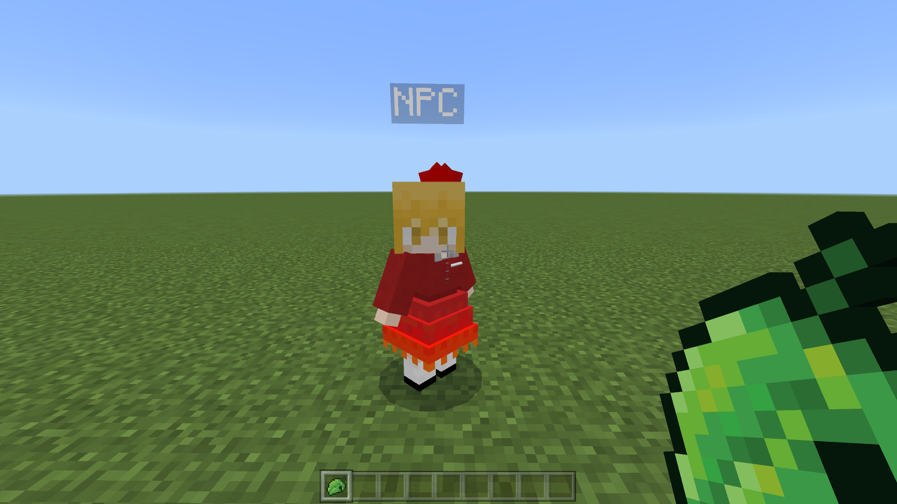
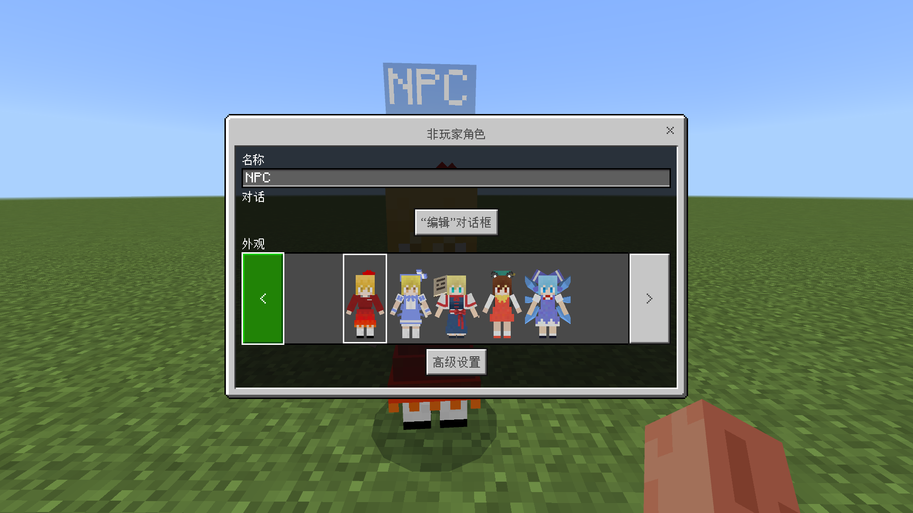
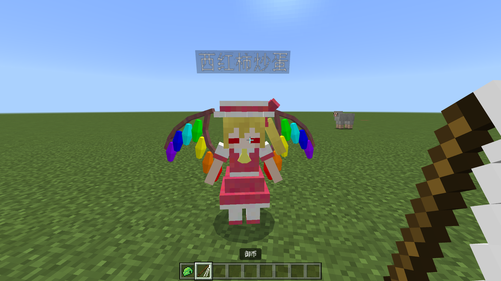

# 车万NPC

##### [English](README.md) | 简体中文

## 使用指南
**Step 1: 获取一个生成蛋**
  
  搜索“生成NPC”，或使用指令“/give @s thnpc:thnpc_spawn_egg”：
  
  
   生成蛋有多种：
  
  | 名称 | 描述 |
  | :---- | ---- |
  | thnpc_spawn_egg | 全部角色 |
  | thnpc_th6_spawn_egg | 红魔乡角色 |
  | gap_spawn_egg | 隙间（用它美化你的传送器！） |
   
**Step 2: 召唤**
  
  对着地面使用生成蛋，召唤出一只秋静叶：
  
  
  右击，是一个与原版NPC一样的界面，不多介绍。
  
  
**Step 3: 消除**
  
  获取一个御币。搜索“御币”，或使用指令“/give @s thnpc:kami"。用它右击NPC即可消除她：
  

## 当前特性
 
 1) 眨眼；
 2) 看着玩家；
 3) 自动回到生成时位置；
 4) 在基岩版正常显示的模型（这花费了很长时间）。
 
## 版权相关
  
  模型来自于：TouHou Little Maid (MIT License) - https://github.com/TartaricAcid/TouhouLittleMaid
